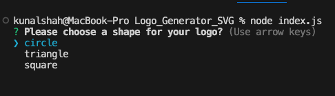
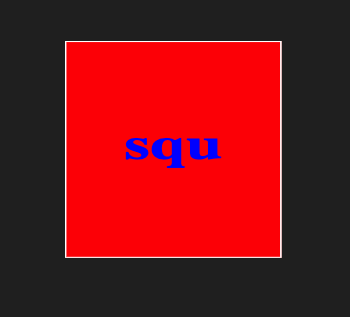
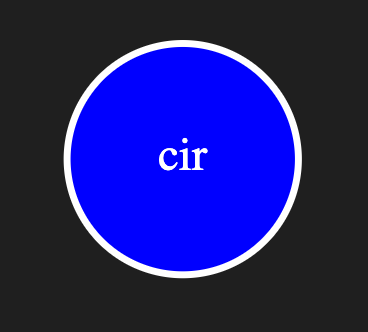
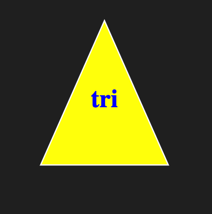
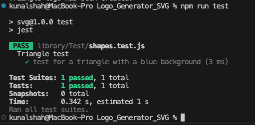

# Logo_Generator_SVG

## Table of Contents

 * [Description](#description)

 * [Live-Screen-Recording](#live-screen-recording)

 * [Screenshots](#screenshots)

 * [Technologies-Used](#technologies-used)

 * [Installation](#installation)

 * [Testing-Instructions](#testing-instructions)

 * [Credits](#credits)

 * [Usage-Information](#usage-information)

 * [License](#license)

 * [Questions](#questions)

## Description

This application is an SVG logo generator where the user can use the CLI prompts to create a logo with custom text, background color and text color. The user is able to run the application, enter their desired text, background color and text color to generate a simple logo for their own use. This application uses Jest and Inquirer as its dependencies, while using Javascript as the main scripting language. 

## Live Screen Recording

https://app.screencastify.com/v3/watch/bCuNbcGaaQQtvQgmJczc

## Screenshots

Logo Generation

()

## Technologies Used

This project is uses Node.js, utilizes inquirer (node package manager), and file system module (node package manager). It also employs jest  (node package manager) for the unit testing conducted in this application. 

## Installation

1. Clone the repo:
   git clone https://github.com/unfazedxx/Logo_Generator_SVG

2. Open in VS Code.

3. Using the terminal, install node.js v16. If you have homebrew, the command should look like the following (brew install node@16).

4. Once node.js v16 is installed, in the terminal, utilize the command npm init -y to initialize and create a package.json where project files will be stored.

5. Next, use the terminal to run the command npm i to install the dependencies associated with this application (Inquirer & jest)

6. To initiallize the application, open an integrated terminal within the Index.js file, and type node index.js. Once completed the CLI will prompt the user with questions to generate the logo. 

7. To view the logo, open the Output file and open the logo.svg file as a preview to see the final product! (a previewer must be installed within VS code, if not available, please open the logo.svg file in the live server to view it on a local webpage.)

## Testing Instructions

To run unit testing, open the terminal, and use the command npm run test. (Ensure the dependencies are installed using (npm i) before testing)

## Credits

Code was created by myself, with the aid of tutor Jacob C. and Assitant instructor Mark A.

## Usage Information

To run this application, use the command line to navigate to the directory of the application, install all dependencies (npm i), then type the command node index.js. You will then be taken through a series of questions. Once all questions have been answered properly, a message will display to the command line telling you your logo has been generated. Find your new logo in the newly generated SVG file.

## License

This application is covered under the MIT License

## Questions

Have additional questions? Please click the links below to reach me through my GitHub account or Email address.

[Link to Github](https://github.com/unfazedxx)

<a href="mailto:shahkun01@gmail.com">shahkun01@gmail.com@gmail.com</a>

Thank you for visiting!!!!